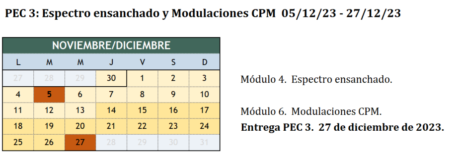
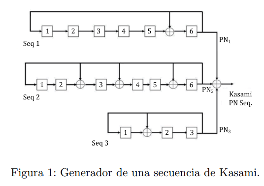
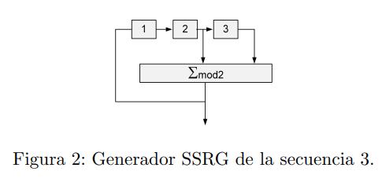

<head>
    <meta charset="UTF-8">
    <title>Master Universitario de Ingenier&iacute;a en Telecomunicaciones&period;</title>
    
    <link rel="stylesheet" href="https://cdn.jsdelivr.net/npm/katex/dist/katex.min.css">
<link href="https://cdn.jsdelivr.net/npm/katex-copytex@latest/dist/katex-copytex.min.css" rel="stylesheet" type="text/css">
    <link rel="stylesheet" href="https://cdn.jsdelivr.net/gh/Microsoft/vscode/extensions/markdown-language-features/media/markdown.css">
<link rel="stylesheet" href="https://cdn.jsdelivr.net/gh/Microsoft/vscode/extensions/markdown-language-features/media/highlight.css">

    

</head>

# Master Universitario de Ingeniería en Telecomunicaciones.

# 81.618 Codificaciones y modulaciones avanzadas - PEC3.

# José Enrique Rodríguez González.

## Presentación.

Esta PEC evalúa los conocimientos adquiridos sobre Técnicas de comunicaciones de espectro ensanchado y Modulaciones digitales de fase continua (CPM) correspondientes al trabajo realizado en los módulos 4 y 6. Está estructurada en cuatro partes, tres obligatorias y una opcional. Las dos primeras partes son más prácticas, la tercera más teórica, y finalmente la cuarta parte (una práctica opcional) propone trabajar con MATLAB algunos de los contenidos trabajados en el módulo 6.

---

## Competencias.

- Capacidad para construir, explotar y gestionar las redes, servicios, procesos y aplicaciones de telecomunicaciones, entendidas estas como sistemas de captación,  transporte, representación, procesamiento, almacenamiento, gestión y presentación de información multimedia, desde el punto de vista de los sistemas de transmisión.

- Capacidad para aplicar las técnicas en que se basan las redes, servicios y aplicaciones de telecomunicación tanto en entornos fijos como móviles, personales, locales o a gran distancia, con diferentes anchos de banda, incluyendo telefonía, radiodifusión, televisión y datos, desde el punto de vista de los sistemas de transmisión.

- Capacidad para la selección de circuitos, subsistemas y sistemas de radiofrecuencia, microondas, radiodifusión, radioenlaces y radiolocalización.

- Capacidad para analizar, codificar, procesar y transmitir información multimedia empleando técnicas de procesado analógico y digital de señal.

---

      

## Objetivos.

- Evaluar la capacidad de realizar cálculos e interpretar parámetros que especifican una señal de espectro ensanchado.

- Evaluar la capacidad de analizar las secuencias pseudoaleatorias empleadas en técnicas de espectro ensanchado.

- Evaluar los conocimientos básicos sobre modulaciones digitales de fase continua (CPM).

---

## Descripción de la PEC.

Esta PEC evalúa los módulos 4 y 6 de la asignatura y el tiempo para realizarla es hasta que finalice el estudio del módulo 6. Se recomienda que una vez terminado el módulo 4 realicéis la parte correspondiente de la PEC, y la finalicéis una vez estudiado el módulo 6. En el caso de la parte que evalúa el módulo 6, dado que el objetivo del módulo es que tengáis una idea de las modulaciones CPM, veréis que en lugar de un problema encontraréis una serie de afirmaciones que deberéis decir si son ciertas o falsas (justificando la respuesta). La respuesta a algunas de ellas la podréis encontrar directamente en los materiales mientras que para poder responder a otras deberéis haber madurado los conceptos del módulo. Como en otras PEC's es importante no dejar el trabajo para el final.

---

## Recursos.

**Recursos Básicos**

- Guías de estudio: GES 5 y GES 6.
- Materiales didácticos: Módulos 4 y 6.

---

## Recursos Complementarios.

- Bibliografía básica y complementaria referenciada en los materiales didácticos.
- MATLAB para la parte opcional (consultad el fichero Matlab.pdf del aula para su instalación).

---

        

## Criterios de valoración.

Las respuestas tienen que estar debidamente justificadas. Sólo se valorarán las respuestas que se hayan justificado correctamente. La resolución de la última parte, correspondiente a un ejercicio práctico, es opcional. El objetivo es que podáis profundizar en algunos aspectos de las señales de espectro ensanchado y CPM. Los alumnos que realicen la parte práctica tienen que saber que se evaluará y se tendrá en cuenta favorablemente al final de curso para redondear la nota final de la EC (siempre a la alza). Como se comenta en la descripción de esa parte, no se evaluará la práctica si os limitáis a adjuntar capturas de pantalla sin comentarios o con comentarios muy escuetos que no demuestren que habéis trabajado y entendido los resultados.

---

## Formato y fecha de entrega.

Se tiene que **entregar la PEC** en el aula a través de la tarea creada para esta finalidad.

Preferiblemente entregad el documento en PDF y comprobad que todas las ecuaciones se ven correctamente. Es posible incluir imágenes escaneadas de documentos elaborados a mano. En este caso, intentad cuidar al máximo la letra y la organización del documento. Si se desea se puede entregar en PDF y en formato Office. Se recomienda no realizar la entrega sólo en formato Word puesto que no siempre las fórmulas se mantienen en todas las versiones.

**Las páginas tienen que estar numeradas y vuestro nombre y apellidos también tiene que aparecer en la parte superior de cada una de las páginas del documento.**

---

           

## Índice

- [Enunciado](#enunciado)
- [Parte 1. Diseño de secuencias PN y transmisión de señales de espectro ensanchado.](#parte-1-diseño-de-secuencias-pn-y-transmisión-de-señales-de-espectro-ensanchado)
- [Pregunta 1.1.](#pregunta-11)
- [Respuesta a la pregunta 1.1.](#respuesta-a-la-pregunta-11)
- [Pregunta 1.3.](#pregunta-13)
- [Respuesta a la pregunta 1.3.](#respuesta-a-la-pregunta-13)
- [Pregunta 1.4.](#pregunta-14)
- [Respuesta a la pregunta 1.4.](#respuesta-a-la-pregunta-14)
- [Pregunta 1.5.](#pregunta-15)
- [Respuesta a la pregunta 1.5.](#respuesta-a-la-pregunta-15)
- [Pregunta 1.6.](#pregunta-16)
- [Respuesta a la pregunta 1.6.](#respuesta-a-la-pregunta-16)
- [Pregunta 1.7.](#pregunta-17)
- [Respuesta a la pregunta 1.7.](#respuesta-a-la-pregunta-17)
- [Pregunta 1.8.](#pregunta-18)
- [Respuesta a la pregunta 1.8.](#respuesta-a-la-pregunta-18)
- [Pregunta 1.10.](#pregunta-110)
- [Respuesta a la pregunta 1.10.](#respuesta-a-la-pregunta-110)
- [Parte 2. Reflexiones sobre modulaciones CPM.](#parte-2-reflexiones-sobre-modulaciones-cpm)
- [Pregunta 2.1.](#pregunta-21)
- [Respuesta a la pregunta 2.1.](#respuesta-a-la-pregunta-21)
- [Pregunta 2.2.](#pregunta-22)
- [Respuesta a la pregunta 2.2.](#respuesta-a-la-pregunta-22)
- [Pregunta 2.3.](#pregunta-23)
- [Respuesta a la pregunta 2.3.](#respuesta-a-la-pregunta-23)
- [Pregunta 2.4.](#pregunta-24)
- [Respuesta a la pregunta 2.4.](#respuesta-a-la-pregunta-24)
- [Pregunta 2.5.](#pregunta-25)
- [Respuesta a la pregunta 2.5.](#respuesta-a-la-pregunta-25)

---

             

## Enunciado.

Seguimos trabajando en esta PEC algunos aspectos de la capa física PHY relacionados con los contenidos de la asignatura. En la PEC se trabajará pues sobre los esquemas de comunicación trabajados en los módulos 4 y 6 del curso que incluyen la transmisión de señales de espectro ensanchado, la generación de secuencias PN y las modulaciones CPM.

[Volver al Índice](#índice)

---

## Parte 1. Diseño de secuencias PN y transmisión de señales de espectro ensanchado.

La siguiente figura corresponde al esquema de un generador de secuencias de Kasami formado por tres generadores MSRG de máxima longitud y una suma que combina las tres secuencias (recordad que todas las sumas son módulo 2).

A partir del esquema anterior se hacen algunas preguntas, primero relativas a la secuencia generada de forma aislada por alguno de los tres generadores MSRG de máxima longitud, y después sobre la secuencia de Kasami obtenida. Las respuestas a las diferentes preguntas deben estar todas correctamente justificadas para que se consideren válidas.

[Volver al Índice](#índice)

---

   

## Pregunta 1.1.

Empezaremos centrando la atención en la secuencia 3. Haciendo la conversión de un generador MMRG a un generador SSRG, podemos afirmar que se trata de un generador SSRG formado por tres etapas que tiene conectados los registros 2 y 3 al sumador módulo 2 tal y como muestra la figura adjunta:

[Volver al Índice](#índice)

---

## Respuesta a la pregunta 1.1.

Como respuesta a la pregunta anterior, creo que no se puede afirmar que la figura 2 corresponde con la secuencia 3 de la figura 1 por las siguientes razones:

La figura 1 muestra que de 1 manda la señal a XOR, sin embargo en la figura 2, muestra que 2 y 3 son las que mandan la señal a la XOR.

[Volver al Índice](#índice)

---

              

## Pregunta 1.3.

Centramos ahora la atención en la secuencia 1 que utilizaremos para las próximas cuatro preguntas. ¿Cuál será la longitud de la secuencia PN1 que se genera si se  inicializan los registros con el valor {0 0 0 1 0 1}?

[Volver al Índice](#índice)

---

## Respuesta a la pregunta 1.3.

Un LFSR puede generar una secuencia de máxima longitud (ML-sequence o m-sequence) si su polinomio característico es primitivo. Para un LFSR de n etapas, la longitud máxima de la secuencia es <math xmlns="http://www.w3.org/1998/Math/MathML"><semantics><mrow><msup><mn>2</mn><mi>n</mi></msup><mo>−</mo><mn>1</mn></mrow><annotation encoding="application/x-tex">2^n-1</annotation></semantics></math>2n−1. En este caso, como seq1 es un LFSR de 6 etapas, la longitud máxima de la secuencia sería <math xmlns="http://www.w3.org/1998/Math/MathML"><semantics><mrow><msup><mn>2</mn><mn>6</mn></msup><mo>−</mo><mn>1</mn><mo>=</mo><mn>63</mn></mrow><annotation encoding="application/x-tex">2^6-1=63</annotation></semantics></math>26−1=63.

[Volver al Índice](#índice)

---

## Pregunta 1.4.

Si la secuencia de bits de información es directamente ensanchada en espectro haciendo uso de la secuencia PN1, y sabiendo que la duración de esta secuencia PN1 (obtenida con primer generador) coincide con el tiempo de bit, ¿cuál será la ganancia de procesado?

[Volver al Índice](#índice)

---

                  

## Respuesta a la pregunta 1.4.

La ganancia de procesamiento se calcula con la fórmula:

<math xmlns="http://www.w3.org/1998/Math/MathML"><semantics><mrow><msub><mi>G</mi><mi>p</mi></msub><mo>=</mo><mfrac><msub><mi>B</mi><mrow><mi>e</mi><mi>n</mi><mi>s</mi><mi>a</mi><mi>n</mi><mi>c</mi><mi>h</mi><mi>a</mi><mi>d</mi><mi>o</mi></mrow></msub><msub><mi>B</mi><mrow><mi>o</mi><mi>r</mi><mi>i</mi><mi>g</mi><mi>i</mi><mi>n</mi><mi>a</mi><mi>l</mi></mrow></msub></mfrac></mrow><annotation encoding="application/x-tex">G_p=\frac{B_{ensanchado}}{B_{original}}</annotation></semantics></math>Gp​=Boriginal​Bensanchado​​

En la que:

- <math xmlns="http://www.w3.org/1998/Math/MathML"><semantics><mrow><msub><mi>G</mi><mi>p</mi></msub></mrow><annotation encoding="application/x-tex">G_p</annotation></semantics></math>Gp​ es la ganancia de procesamiento.

- <math xmlns="http://www.w3.org/1998/Math/MathML"><semantics><mrow><msub><mi>B</mi><mrow><mi>e</mi><mi>n</mi><mi>s</mi><mi>a</mi><mi>n</mi><mi>c</mi><mi>h</mi><mi>a</mi><mi>d</mi><mi>o</mi></mrow></msub></mrow><annotation encoding="application/x-tex">B_{ensanchado}</annotation></semantics></math>Bensanchado​ es el ancho de banda de la señal después del ensanchamiento de espectro.

- <math xmlns="http://www.w3.org/1998/Math/MathML"><semantics><mrow><msub><mi>B</mi><mrow><mi>o</mi><mi>r</mi><mi>i</mi><mi>g</mi><mi>i</mi><mi>n</mi><mi>a</mi><mi>l</mi></mrow></msub></mrow><annotation encoding="application/x-tex">B_{original}</annotation></semantics></math>Boriginal​ es el ancho de banda de la señal original antes del ensanchamiento.

En el caso de la modulación DSSS, el ancho de banda ensanchado suele ser aproximadamente igual al inverso del tiempo de un bit de la secuencia PN. Si la duración de la secuencia PN1 coincide con el tiempo de bit de la secuencia de bits de información, entonces el ancho de banda ensanchado es aproximadamente igual al número de bits en la secuencia PN1 por segundo.

Dado que la secuencia PN1 tiene una longitud L (en este caso, si seguimos el ejemplo anterior, L=63), y dado que la duración de PN1 coincide con el tiempo de bit, la ganancia de procesamiento se convierte en el número de elementos en la secuencia PN1. Entonces, la ganancia de procesamiento sería:

<math xmlns="http://www.w3.org/1998/Math/MathML"><semantics><mrow><msub><mi>G</mi><mi>p</mi></msub><mo>=</mo><mi>L</mi></mrow><annotation encoding="application/x-tex">G_p=L</annotation></semantics></math>Gp​=L

Por lo tanto, si la secuencia PN1 tiene 63 bits, la ganancia de procesamiento sería 63. Esto significa que el ancho de banda de la señal ensanchada es 63 veces mayor que el ancho de banda de la señal original.

[Volver al Índice](#índice)

---

## Pregunta 1.5.

Si el tiempo de bit es de 1µs y como pulso conformador para transmitir los chips se utiliza un pulso de raíz de coseno alzado con factor de roll-off del 35 % (α = 0,35), ¿cuál será el ancho de banda de la señal?

(Nota, recuerde que el ancho de banda de una señal paso banda que utiliza un pulso de raíz de coseno alzado es Bw = 1/T · (1 + α) con T el tiempo de símbolo).

[Volver al Índice](#índice)

---

    

## Respuesta a la pregunta 1.5.

Para calcular el ancho de banda de una señal que utiliza un pulso de raíz de coseno alzado con un factor de roll-off α, podemos usar la fórmula proporcionada:

<math xmlns="http://www.w3.org/1998/Math/MathML"><semantics><mrow><msub><mi>B</mi><mi>ω</mi></msub><mo>=</mo><mfrac><mn>1</mn><mi>T</mi></mfrac><mo>⋅</mo><mo stretchy="false">(</mo><mn>1</mn><mo>+</mo><mi>α</mi><mo stretchy="false">)</mo></mrow><annotation encoding="application/x-tex">B_\omega = \frac{1}{T} \cdot (1+ \alpha)</annotation></semantics></math>Bω​=T1​⋅(1+α)

En la que:

- <math xmlns="http://www.w3.org/1998/Math/MathML"><semantics><mrow><msub><mi>B</mi><mi>ω</mi></msub></mrow><annotation encoding="application/x-tex">B_\omega</annotation></semantics></math>Bω​ es el ancho de banda de la señal.
- <math xmlns="http://www.w3.org/1998/Math/MathML"><semantics><mrow><mi>T</mi></mrow><annotation encoding="application/x-tex">T</annotation></semantics></math>T es el tiempo de símbolo (en este caso, el tiempo de bit).
- <math xmlns="http://www.w3.org/1998/Math/MathML"><semantics><mrow><mi>α</mi></mrow><annotation encoding="application/x-tex">\alpha</annotation></semantics></math>α es el factor de roll-off.

Dado que el tiempo de bit <math xmlns="http://www.w3.org/1998/Math/MathML"><semantics><mrow><mi>T</mi></mrow><annotation encoding="application/x-tex">T</annotation></semantics></math>T es de 1 µs (microsegundo) y el factor de roll-off <math xmlns="http://www.w3.org/1998/Math/MathML"><semantics><mrow><mi>α</mi></mrow><annotation encoding="application/x-tex">\alpha</annotation></semantics></math>α es 0,35 (35 %), podemos sustituir estos valores en la fórmula para calcular el ancho de banda, usando el siguiente script de Python realizamos los cálculos:

~~~Python
# Definiendo los parámetros
T = 1e-6  # Tiempo de bit en segundos (1 µs)
alpha = 0.35  # Factor de roll-off

# Calculando el ancho de banda
Bw = (1 / T) * (1 + alpha)
print("Bw: ", Bw, " Hz.")
~~~

La respuesta de la consola es la siguiente:

~~~Shell
Bw:  1350000.0  Hz.
~~~

Por tanto, el ancho de banda de la señal que utiliza un pulso de raíz de coseno alzado con un factor de roll-off del 35% y un tiempo de bit de 1 µs es de 1.35 MHz (megahercios).

[Volver al Índice](#índice)

---

## Pregunta 1.6.

Respecto a la respuesta a las tres preguntas anteriores, ¿hubiera sido distinta si hubiéramos inicializado los registros del generador MSRG con los valores {0 0 0 0 0 1}? Justifique la respuesta y en caso afirmativo indique cuál hubiera sido el nuevo ancho de banda.

[Volver al Índice](#índice)

---

 

## Respuesta a la pregunta 1.6.

Las respuestas a las tres preguntas anteriores no cambiarían si inicializáramos los registros del generador MSRG con los valores {0 0 0 0 0 1} en lugar de {0 0 0 1 0 1}. Explico por qué:

**Longitud de la Secuencia PN1.**

La longitud de la secuencia generada por un generador de registro de desplazamiento lineal de retroalimentación (LFSR) se determina por la longitud del registro y la estructura de la retroalimentación, siempre y cuando el polinomio característico sea primitivo y la configuración inicial no sea todos ceros. Tanto {0 0 0 1 0 1} como {0 0 0 0 0 1} son configuraciones no nulas, por lo que ambas producirán una secuencia de máxima longitud de <math xmlns="http://www.w3.org/1998/Math/MathML"><semantics><mrow><msup><mn>2</mn><mi>n</mi></msup><mo>−</mo><mn>1</mn></mrow><annotation encoding="application/x-tex">2^n-1</annotation></semantics></math>2n−1 para un LFSR de n etapas, asumiendo que la configuración de retroalimentación se mantiene constante y es la adecuada para una secuencia de máxima longitud.

**Ganancia de Procesado en DSSS.**

La ganancia de procesado depende de la longitud de la secuencia PN1, que, como se explicó anteriormente, no cambia con la nueva configuración inicial. Por lo tanto, la ganancia de procesado seguiría siendo la misma.

**Ancho de Banda de la Señal**

El ancho de banda de la señal que utiliza un pulso de raíz de coseno alzado se calcula en función del tiempo de bit y el factor de roll-off, y no depende de la configuración inicial del generador MSRG. Por lo tanto, el ancho de banda seguiría siendo 1.35 MHz bajo la nueva configuración inicial.

En resumen, la inicialización de los registros del generador MSRG con {0 0 0 0 0 1} en lugar de {0 0 0 1 0 1} no afectaría las respuestas a las tres preguntas anteriores, asumiendo que la configuración de retroalimentación del LFSR es adecuada para generar una secuencia de máxima longitud y que el LFSR no se inicializa en un estado de todos ceros.

[Volver al Índice](#índice)

---

## Pregunta 1.7.

Fijémonos ahora exclusivamente en los generadores 1 y 2, eliminando de la Figura 1 el generador 3, esto es PN3=0. Justifique porqué el esquema podría servir para generar códigos de Gold e indique cuál sería la longitud de las secuencias de Gold obtenidas.

[Volver al Índice](#índice)

---

   

## Respuesta a la pregunta 1.7.

Para generar códigos de Gold, se requieren dos condiciones:

1. Dos m-secuencias: Se necesitan dos generadores LFSR que produzcan secuencias de máxima longitud. Estas secuencias deben ser generadas por LFSRs con el mismo número de etapas y polinomios característicos que sean preferiblemente "preferidos" o que tengan una buena correlación cruzada.
2. Combinación Lineal (XOR): Las dos m-secuencias se combinan mediante una operación XOR para generar una familia de códigos de Gold.

Considerando solo los generadores 1 y 2 (eliminando el generador 3), y asumiendo que ambos generan m-secuencias, el esquema puede servir para generar códigos de Gold. Si cada generador tiene un número de etapas n, entonces cada uno generará una secuencia con una longitud de <math xmlns="http://www.w3.org/1998/Math/MathML"><semantics><mrow><msup><mn>2</mn><mi>n</mi></msup><mo>−</mo><mn>1</mn></mrow><annotation encoding="application/x-tex">2^n-1</annotation></semantics></math>2n−1. Al combinar estas dos secuencias mediante XOR, se generan los códigos de Gold.

La longitud de las secuencias de Gold resultantes será igual a la longitud de las m-secuencias individuales. Si cada generador (seq1 y seq2) es un LFSR de 6 etapas, como se mencionó anteriormente, entonces cada m-secuencia tiene una longitud de <math xmlns="http://www.w3.org/1998/Math/MathML"><semantics><mrow><msup><mn>2</mn><mn>6</mn></msup><mo>−</mo><mn>1</mn><mo>=</mo><mn>63</mn></mrow><annotation encoding="application/x-tex">2^6-1=63</annotation></semantics></math>26−1=63. Por lo tanto, la longitud de las secuencias de Gold resultantes también será 63.

Los códigos de Gold son especialmente valorados por sus buenas propiedades de correlación cruzada, lo que los hace adecuados para aplicaciones donde se requiere distinguir entre varias señales en un entorno ruidoso o con interferencias, como en sistemas de comunicación por satélite o en sistemas de radar.

[Volver al Índice](#índice)

---

## Pregunta 1.8.

Bajo el supuesto de la cuestión anterior (el generador 3 está anulado), ¿cuántas secuencias de Gold diferentes podríamos obtener? ¿Qué debería hacerse para obtener las diferentes secuencias?

[Volver al Índice](#índice)

---

        

## Respuesta a la pregunta 1.8.

En la generación de códigos de Gold utilizando dos secuencias de máximo recorrido (m-sequences) de la misma longitud, la cantidad de secuencias de Gold diferentes que se pueden obtener depende de las propiedades de estas secuencias m-sequences. Para dos m-sequences dadas, la cantidad de códigos de Gold únicos que se pueden generar es igual al número de desplazamientos no cíclicos posibles de una de las secuencias con respecto a la otra, más uno.

Dado que las m-sequences generadas por los generadores 1 y 2 (seq1 y seq2) tienen cada una una longitud de <math xmlns="http://www.w3.org/1998/Math/MathML"><semantics><mrow><msup><mn>2</mn><mn>6</mn></msup><mo>−</mo><mn>1</mn><mo>=</mo><mn>63</mn></mrow><annotation encoding="application/x-tex">2^6-1=63</annotation></semantics></math>26−1=63, existen 63 desplazamientos no cíclicos posibles de una secuencia con respecto a la otra. Por lo tanto, se pueden generar 63 códigos de Gold diferentes mediante el desplazamiento de una de las secuencias m-sequences con respecto a la otra y aplicando la operación XOR entre ellas en cada desplazamiento. Además, debemos contar la combinación sin desplazamiento, por lo que el total de secuencias de Gold diferentes que se pueden obtener es 64.

Para obtener estas diferentes secuencias de Gold, se debe:

1. Mantener una de las secuencias m-sequences fija (por ejemplo, la secuencia generada por seq1).
2. Desplazar cíclicamente la otra secuencia m-sequence (la generada por seq2) en todas las posiciones posibles desde 0 hasta 62 (un total de 63 desplazamientos).
3. En cada desplazamiento, realizar una operación XOR entre las dos secuencias para obtener una secuencia de Gold única.
4. Incluir también la combinación XOR de las dos secuencias sin desplazamiento.

Este proceso resultará en 64 secuencias de Gold diferentes, cada una con propiedades únicas de correlación cruzada que son útiles en diversas aplicaciones de comunicaciones.

[Volver al Índice](#índice)

---

               

## Pregunta 1.10.

De entre los siguientes sistemas de comunicación, indique en cuál o cuáles sería útil utilizar las secuencias de Kasami obtenidas con el esquema de la Figura 1, y en cuál o cuáles no podría utilizarse.

Justifique razonadamente cada una de las respuestas.

- Un sistema de comunicación con una estrategia de acceso múltiple Qs-CDMA con 4 usuarios.

- Un sistema de comunicación con una estrategia de acceso múltiple A-CDMA con 1000 usuarios.

- Un sistema FH-CDMA con un solo usuario y con el fin de proteger la señal frente a interferencias de banda estrecha.

- Un sistema de comunicación seguras donde se propone un mecanismo de espectro ensanchado para garantizar el secreto de la comunicación.

[Volver al Índice](#índice)

---

                         

## Respuesta a la pregunta 1.10.

**Un sistema de comunicación con una estrategia de acceso múltiple Qs-CDMA con 4 usuarios.**

Para evaluar la idoneidad de las secuencias de Kasami obtenidas con el esquema de la Figura 1 en un sistema de comunicación con una estrategia de acceso múltiple Qs-CDMA (Quasi-Synchronous Code Division Multiple Access) con 4 usuarios, debemos considerar las propiedades de las secuencias de Kasami y las necesidades del sistema Qs-CDMA.

*Secuencias de Kasami en Sistemas Qs-CDMA.*

1. Propiedades de las Secuencias de Kasami.
    - Las secuencias de Kasami son conocidas por sus buenas propiedades de correlación cruzada, lo que significa que la interferencia entre señales utilizando diferentes secuencias de Kasami es baja.
    - Estas secuencias son adecuadas para sistemas CDMA debido a su capacidad para permitir que múltiples usuarios compartan el mismo espectro de frecuencia simultáneamente, minimizando la interferencia entre ellos.
2. Características de los Sistemas Qs-CDMA.
    - Los sistemas Qs-CDMA son una variante del CDMA donde las transmisiones de diferentes usuarios están ligeramente desalineadas en el tiempo. Este desalineamiento puede ser intencional o el resultado de diferencias en las distancias de transmisión.
    - El sistema Qs-CDMA aún requiere secuencias con buenas propiedades de autocorrelación y correlación cruzada para minimizar la interferencia entre usuarios.
3. Número de Usuarios.
    -  Las secuencias de Kasami, especialmente en grupos grandes, pueden proporcionar un número suficiente de secuencias únicas para permitir la coexistencia de múltiples usuarios en el mismo canal con una interferencia mínima.

*Aplicación en un Sistema Qs-CDMA con 4 Usuarios.*

1. Viabilidad.
    - Las secuencias de Kasami son adecuadas para su uso en un sistema Qs-CDMA con 4 usuarios. Su capacidad para proporcionar secuencias únicas con buenas propiedades de correlación cruzada y autocorrelación las hace ideales para minimizar la interferencia entre los usuarios, incluso cuando sus señales están ligeramente desfasadas en el tiempo, como es el caso en Qs-CDMA.
2. Consideraciones Adicionales.
    - Sin embargo, la efectividad de estas secuencias dependerá de detalles específicos del sistema, como el grado de desalineación temporal entre usuarios y las características exactas del entorno de transmisión.

En resumen, las secuencias de Kasami obtenidas con el esquema proporcionado son adecuadas para su uso en un sistema de comunicación Qs-CDMA con 4 usuarios, debido a sus propiedades de correlación favorables y la capacidad de soportar múltiples usuarios en un entorno de acceso múltiple.

**Un sistema de comunicación con una estrategia de acceso múltiple A-CDMA con 1000 usuarios.**

Para evaluar el uso de secuencias de Kasami en un sistema de comunicación con una estrategia de acceso múltiple A-CDMA (Asynchronous Code Division Multiple Access) con 1000 usuarios, debemos considerar las características específicas tanto de las secuencias de Kasami como de la tecnología A-CDMA.

*Secuencias de Kasami en Sistemas A-CDMA:*

1. Propiedades de las Secuencias de Kasami:
    - Las secuencias de Kasami, como mencionado anteriormente, tienen excelentes propiedades de correlación cruzada y autocorrelación, lo que las hace útiles en sistemas CDMA para minimizar la interferencia entre usuarios.
    - Son particularmente efectivas en sistemas donde el número de usuarios no excede significativamente la cantidad de secuencias únicas disponibles.
2. Características de los Sistemas A-CDMA:
    - En A-CDMA, las transmisiones de los usuarios son completamente asincrónicas. Esto significa que las señales de diferentes usuarios pueden llegar en cualquier momento, sin ninguna coordinación de tiempo.
    - Esta asincronía puede aumentar la complejidad de manejar la interferencia entre usuarios, especialmente cuando hay un gran número de ellos.
3. Capacidad para Soportar 1000 Usuarios:
    - El número de secuencias únicas que pueden ser generadas por un conjunto de secuencias de Kasami es un factor crítico aquí. Dependiendo de la longitud de las secuencias y si se utilizan pequeños o grandes conjuntos de Kasami, el número de secuencias únicas disponibles puede variar.
    - Para 1000 usuarios, se necesitaría un conjunto de secuencias que pueda proporcionar suficientes códigos únicos para todos los usuarios, lo cual puede ser un desafío para las secuencias de Kasami, especialmente si la longitud de las secuencias es limitada.

*Aplicación en un Sistema A-CDMA con 1000 Usuarios.*

1. Desafíos.
    - Dado el gran número de usuarios (1000), puede ser difícil proporcionar secuencias únicas y de alta calidad para cada usuario con las secuencias de Kasami, especialmente si la longitud de las secuencias es limitada.
2. Viabilidad.
    - Si bien las secuencias de Kasami son teóricamente aplicables en un entorno A-CDMA, su viabilidad en un sistema con 1000 usuarios es cuestionable debido a la limitación en el número de secuencias únicas disponibles y a la complejidad aumentada por la naturaleza asincrónica del sistema.

En resumen, aunque las secuencias de Kasami son adecuadas para sistemas CDMA en términos de sus propiedades de correlación, la aplicación práctica en un sistema A-CDMA con 1000 usuarios presenta desafíos significativos debido a la limitación en la cantidad de secuencias únicas que pueden generarse y la complejidad adicional introducida por la asincronía del sistema.

**Un sistema FH-CDMA con un solo usuario y con el fin de proteger la señal frente a interferencias de banda estrecha.**

Para analizar la utilidad de las secuencias de Kasami en un sistema de comunicación FH-CDMA (Frequency-Hopping Code Division Multiple Access) con un solo usuario y con el objetivo de proteger la señal contra interferencias de banda estrecha, es necesario considerar las características tanto de las secuencias de Kasami como de la tecnología FH-CDMA.

*Secuencias de Kasami en Sistemas FH-CDMA*

1. Propiedades de las Secuencias de Kasami.
    - Las secuencias de Kasami son conocidas por sus excelentes propiedades de correlación cruzada y autocorrelación, lo cual es beneficioso para minimizar la interferencia entre usuarios en sistemas CDMA. Aunque para un sistema con un solo usuario, esta ventaja es menos relevante.
    - La principal ventaja de las secuencias de Kasami en este contexto sería su capacidad para generar patrones de salto de frecuencia pseudoaleatorios y difíciles de predecir, lo cual es útil para la resistencia a interferencias y la seguridad en sistemas FH-CDMA.
2. Características del Sistema FH-CDMA.
    - En FH-CDMA, la señal se transmite a través de un espectro de frecuencia cambiando periódicamente la frecuencia de transmisión según un patrón predeterminado. Esto ayuda a proteger contra interferencias de banda estrecha, ya que la interferencia en una frecuencia particular solo afectará la señal durante una fracción del tiempo de transmisión.
    - La eficacia del FH-CDMA en la protección contra interferencias depende en gran medida de la imprevisibilidad y la distribución de los saltos de frecuencia.
3. Uso para Protección contra Interferencias.
    - Dado que el objetivo principal es proteger la señal frente a interferencias de banda estrecha, el uso de secuencias de Kasami puede ser muy efectivo. Las secuencias pueden proporcionar un patrón de salto de frecuencia impredecible y bien distribuido, lo que hace difícil para un interferente focalizar y perturbar la señal de manera continua.

*Aplicación en un Sistema FH-CDMA con Un Solo Usuario.*

1. Viabilidad.
    - En un sistema FH-CDMA con un solo usuario, las secuencias de Kasami son perfectamente adecuadas y probablemente muy efectivas. Aunque su principal ventaja en entornos de múltiples usuarios (buenas propiedades de correlación cruzada) no es tan relevante aquí, su capacidad para generar patrones de salto de frecuencia complejos y seguros es muy valiosa.
2. Beneficios Adicionales.
    - Además de proteger contra interferencias, el uso de secuencias de Kasami puede mejorar la seguridad y la resistencia a intentos de jamming (inhibición de señal), ya que los patrones de salto son difíciles de predecir y rastrear.

En conclusión, las secuencias de Kasami son muy adecuadas para un sistema FH-CDMA con un solo usuario, especialmente con el objetivo de proteger la señal contra interferencias de banda estrecha. Su capacidad para generar patrones de salto de frecuencia complejos y seguros es un activo significativo en este contexto.

**Un sistema de comunicación seguras donde se propone un mecanismo de espectro ensanchado para garantizar el secreto de la comunicación.**

En un sistema de comunicación segura que propone un mecanismo de espectro ensanchado para garantizar el secreto de la comunicación, las secuencias de Kasami pueden desempeñar un papel importante debido a sus características particulares. Aquí, analizamos cómo estas secuencias se adaptan a dicho sistema:

*Secuencias de Kasami en Sistemas de Espectro Ensanchado para Seguridad en Comunicaciones.*

1. Propiedades de las Secuencias de Kasami.
    - Las secuencias de Kasami son conocidas por sus excelentes propiedades de autocorrelación y correlación cruzada. Estas características son cruciales en sistemas de espectro ensanchado, donde la distinción clara entre diferentes secuencias es esencial para reducir la interferencia y aumentar la seguridad.
    - La complejidad y la naturaleza pseudoaleatoria de las secuencias de Kasami las hacen difíciles de predecir o interceptar, lo cual es fundamental para garantizar la confidencialidad en las comunicaciones.
2. Espectro Ensanchado para Comunicaciones Seguras.
    - El espectro ensanchado es una técnica utilizada para extender deliberadamente una señal de banda estrecha a lo largo de un espectro de frecuencias más amplio. Esto se hace generalmente mediante el uso de una secuencia de códigos pseudoaleatorios que modula la señal de datos.
    - Una de las ventajas del espectro ensanchado es que dificulta la interceptación o el jamming (bloqueo) de las señales, ya que sólo el receptor con la secuencia de códigos correcta puede desmodular eficazmente la señal.
3. Secreto en la Comunicación.
    - En sistemas donde el secreto es primordial, el uso de secuencias complejas y únicas para cada comunicación es esencial. Las secuencias de Kasami pueden proporcionar esta complejidad y unicidad, aumentando la seguridad de las comunicaciones.

*Aplicación en Sistemas de Comunicación Seguras con Espectro Ensanchado.*

1. Viabilidad.
    - Las secuencias de Kasami son muy adecuadas para su uso en sistemas de comunicación seguros que emplean técnicas de espectro ensanchado. Su complejidad y sus buenas propiedades de correlación las hacen ideales para garantizar tanto la integridad de la señal como la confidencialidad de la comunicación.
2. Beneficios Adicionales.
    - Además de mejorar la seguridad, estas secuencias pueden ayudar a mitigar la interferencia y el jamming, lo que es especialmente valioso en escenarios donde la seguridad y la fiabilidad de la comunicación son críticas.

En conclusión, las secuencias de Kasami son muy adecuadas para sistemas de comunicación seguras que utilizan técnicas de espectro ensanchado para garantizar el secreto de la comunicación. Su capacidad para proporcionar secuencias complejas y únicas es un activo significativo en la protección contra interceptaciones y otras formas de interferencia en las comunicaciones.

Un ejemplo práctico usado durante mi empleo de Teniente Jefe de Sección de Transmisiones era el uso del Radio Teléfono PR4G cuyas características han sido oportunamente publicas en el portal web del [Ejército de Tierra](https://ejercito.defensa.gob.es/materiales/transmisiones/Radiotelefono.html).

[Volver al Índice](#índice)

---

                                

## Parte 2. Reflexiones sobre modulaciones CPM.

En este ejercicio se evalúan los conocimientos básicos sobre modulaciones digitales de fase continua (CPM). Responder a las siguientes afirmaciones indicando si son ciertas o falsas y justificando la respuesta.

No se considerarán válidas las respuestas que indiquen correctamente si son cierto o falso pero que estén mal justificadas (especialmente cuando se trate de justificar que la respuesta es falsa).

[Volver al Índice](#índice)

---

## Pregunta 2.1.

Una modulación GMSK diseñada con un filtro que cumple la relación B · Tb = 1 (relación de producto de ancho de banda B por tiempo de símbolo Tb) necesita del doble de ancho de banda que una diseñada con la relación B · Tb = 0,5.

[Volver al Índice](#índice)

---

## Respuesta a la pregunta 2.1.

***La afirmación es falsa.***

Para entender por qué, primero debemos considerar qué es la modulación GMSK (Gaussian Minimum Shift Keying) y cómo afectan los parámetros B y Tb a su comportamiento.

La GMSK es una forma de modulación de fase continua (CPM) que utiliza un filtro gaussiano para suavizar las transiciones entre símbolos. Esto ayuda a reducir el ancho de banda requerido y la dispersión de energía fuera de la banda principal. En GMSK, el producto B⋅Tb es un parámetro crucial que determina la forma del filtro gaussiano aplicado. Aquí, B es el ancho de banda del filtro gaussiano y Tb es el tiempo de duración de un bit (o símbolo).

Con un B⋅Tb=1, tenemos un filtro gaussiano con un ancho de banda-temporal más amplio, lo que resulta en una menor dispersión de energía pero a costa de una mayor superposición entre símbolos consecutivos (mayor ISI, Inter-Symbol Interference).
Con un B⋅Tb=0.5, el filtro es más estrecho, lo que reduce la ISI pero aumenta el ancho de banda efectivo de la señal.
Contrario a lo que sugiere la afirmación, un B⋅Tb=1 no necesita del doble de ancho de banda que uno con B⋅Tb=0.5. De hecho, es al revés: un valor más bajo de B⋅Tb tiende a requerir más ancho de banda porque la señal es menos suave (más abrupta en sus transiciones) y, por lo tanto, ocupa un espectro más amplio.

En resumen, una modulación GMSK con B⋅Tb=1 es más eficiente en términos de ancho de banda que una con B⋅Tb=0.5, no menos.

[Volver al Índice](#índice)

---

## Pregunta 2.2.

Las cuatro primeras modulaciones de la siguiente lista son de envolvente constante mientras que la quinta (la 4-FSK) no lo es por no ser binaria: GFSK, MSK, O-QPSK, 2-FSK, 4 -FSK.

[Volver al Índice](#índice)

---

## Respuesta a la pregunta 2.2.

***La afirmación es falsa.***

Procederé a analizar cada una de las modulaciones digitales citadas de manera individual.

1. GFSK (Gaussian Frequency Shift Keying).
    - Esta es una forma de modulación de frecuencia donde la señal es modulada en frecuencia, pero con una transición suavizada entre los estados debido a la filtración gaussiana. Esto resulta en una envolvente constante, ya que las transiciones suaves evitan cambios abruptos en la amplitud.
2. MSK (Minimum Shift Keying).
    - Es un tipo de modulación de frecuencia donde la desviación de la frecuencia es mínima para cumplir con la ortogonalidad. MSK es de hecho un caso especial de GFSK y también mantiene una envolvente constante debido a la forma en que las transiciones de frecuencia se realizan suavemente.
3. O-QPSK (Offset Quadrature Phase Shift Keying).
    - En O-QPSK, los cambios de fase están desfasados en el tiempo para una de las componentes de fase. Esto ayuda a suavizar las transiciones de fase y puede diseñarse para mantener una envolvente constante, aunque depende del diseño específico del esquema O-QPSK.
4. 2-FSK (Frequency Shift Keying con 2 frecuencias).
    - En 2-FSK, solo hay dos frecuencias, una para cada símbolo binario. Este tipo de modulación puede ser diseñado para tener una envolvente constante, especialmente si las transiciones entre las frecuencias son suavizadas.
5. 4-FSK (Frequency Shift Keying con 4 frecuencias).
    - Aquí es donde la afirmación podría ser cuestionable. 4-FSK utiliza cuatro frecuencias distintas. Aunque es posible diseñar 4-FSK para que tenga una envolvente constante, no es inherentemente de envolvente constante como lo son las modulaciones con dos estados (como 2-FSK o MSK). La constancia de la envolvente en 4-FSK dependerá de cómo se diseñen las transiciones entre las frecuencias.

En conclusión, la afirmación de que "las cuatro primeras modulaciones son de envolvente constante mientras que la quinta (la 4-FSK) no lo es por no ser binaria" ***es falsa***. El número de estados de frecuencia en la modulación FSK (ya sea binaria o no) no determina directamente si la modulación tiene una envolvente constante o no. Lo que importa es cómo se manejan las transiciones entre estos estados de frecuencia.

[Volver al Índice](#índice)

---

## Pregunta 2.3.

Una modulación FSK binaria con índice de modulación h = 0,5 y desviación de frecuencia fd = 6,25kHz transmite la señal a 25Kbps.

[Volver al Índice](#índice)

---

## Respuesta a la pregunta 2.3.

***La afirmación es falsa.***

La afirmación sobre la modulación FSK (Frequency-Shift Keying) binaria debe evaluarse considerando dos aspectos principales: el índice de modulación h y la desviación de frecuencia <math xmlns="http://www.w3.org/1998/Math/MathML"><semantics><mrow><msub><mi>f</mi><mi>d</mi></msub></mrow><annotation encoding="application/x-tex">f_d</annotation></semantics></math>fd​. Además, se menciona que la tasa de transmisión de la señal es de 25 Kbps (kilobits por segundo).

1. Índice de Modulación h.
    - En FSK, el índice de modulación h se define como la relación entre la desviación de frecuencia y la tasa de bit. Para FSK binario, se puede expresar como:
        - <math xmlns="http://www.w3.org/1998/Math/MathML"><semantics><mrow><mi>h</mi><mo>=</mo><mfrac><msub><mi>f</mi><mi>d</mi></msub><msub><mi>R</mi><mi>b</mi></msub></mfrac></mrow><annotation encoding="application/x-tex">h=\frac{f_d}{R_b}</annotation></semantics></math>h=Rb​fd​​, donde <math xmlns="http://www.w3.org/1998/Math/MathML"><semantics><mrow><msub><mi>f</mi><mi>d</mi></msub></mrow><annotation encoding="application/x-tex">f_d</annotation></semantics></math>fd​ es la desviación de frecuencia (6,25 kHz) y <math xmlns="http://www.w3.org/1998/Math/MathML"><semantics><mrow><msub><mi>R</mi><mi>b</mi></msub></mrow><annotation encoding="application/x-tex">R_b</annotation></semantics></math>Rb​ es la tasa de bit (25 Kbps).

Dado esto, podemos calcular el índice de modulación real para la modulación FSK binaria proporcionada y compararlo con el valor dado de h=0.5. Si coinciden, la afirmación sería cierta, de lo contrario, sería falsa.

Procedemos a realizar los cálculos mediante el siguiente script de python.

~~~Python
# Datos proporcionados
fd = 6.25e3  # Desviación de frecuencia en Hz
Rb = 25e3    # Tasa de bit en bps

# Cálculo del índice de modulación h
h_calculado = fd / Rb
print("h_calculado: ", h_calculado)
~~~

La respuesta de la consola es:

~~~Shell
h_calculado:  0.25
~~~

La afirmación dice que h=0.5, por lo que la afirmación es falsa.

[Volver al Índice](#índice)

---

## Pregunta 2.4.

Si a una señal modulada con una modulación de fase continua como es la MSK se le aplica un proceso de ensanchamiento espectral por secuencia directa (ver por ejemplo el esquema de la figura 1 del módulo 4 de los materiales) la señal resultante deja de ser de fase continua.

[Volver al Índice](#índice)

---

## Respuesta a la pregunta 2.4.

***La afirmación es falsa.***

Para entender por qué, es importante primero comprender los conceptos de Modulación por Desplazamiento Mínimo de Frecuencia (MSK, por sus siglas en inglés) y el ensanchamiento espectral por secuencia directa.

1. Modulación MSK (Minimum Shift Keying).
    - Es una forma de modulación de fase continua (CPM) en la que la señal modulada tiene una transición continua en la fase. En MSK, los cambios de fase son siempre de 180 grados, lo que asegura que la señal es de fase continua, evitando descontinuidades en la fase de la señal.
2. Ensanchamiento espectral por secuencia directa.
    - Este método implica la modulación de la señal con una secuencia de código pseudoaleatoria, que tiene el efecto de esparcir el espectro de la señal original. Este proceso no altera la naturaleza de la modulación subyacente, sino que modifica su espectro.

Cuando se aplica el ensanchamiento espectral a una señal MSK, lo que se modifica es el espectro de la señal, no su fase. La característica clave de la modulación de fase continua es que la señal tiene una transición de fase suave y continua, lo que se mantiene incluso después del proceso de ensanchamiento espectral. Por lo tanto, la señal resultante sigue siendo de fase continua, aunque con un espectro ensanchado.

En resumen, la aplicación de ensanchamiento espectral por secuencia directa a una señal MSK no altera el hecho de que sea una señal de fase continua. La afirmación es falsa porque la característica de fase continua de la MSK se mantiene incluso después del proceso de ensanchamiento espectral.

[Volver al Índice](#índice)

---

## Pregunta 2.5.

El valor de la envolvente de las modulaciones CPM no depende del número de bits por símbolo, pero si de la forma del pulso q(t).

[Volver al Índice](#índice)

---

## Respuesta a la pregunta 2.5.

***La afirmación es cierta.***

Procederé a evaluar la afirmación sobre las modulaciones de fase continua (CPM, por sus siglas en inglés):

**Afirmación:** "El valor de la envolvente de las modulaciones CPM no depende del número de bits por símbolo, pero sí de la forma del pulso q(t)."

**Evaluación:**

1. "El valor de la envolvente de las modulaciones CPM no depende del número de bits por símbolo": Esta parte de la afirmación es ***Cierto***.
    - Justificación.
        - En las modulaciones CPM, la información se transmite a través de cambios en la fase de la señal portadora. La envolvente de una señal CPM, es decir, su amplitud instantánea, se mantiene constante. Esto es una característica distintiva de las modulaciones de fase continua, donde el objetivo es mantener constante la amplitud de la señal para minimizar el ancho de banda y mejorar la eficiencia energética. El número de bits por símbolo, que determina el número de fases posibles en la señal, afecta la estructura de fase pero no la amplitud de la envolvente.

2. "Pero sí de la forma del pulso q(t)": Esta parte de la afirmación es ***Cierto***.
    - Justificación.
        - La forma del pulso q(t) en CPM es crucial para determinar las características de la señal modulada, incluyendo su espectro y eficiencia espectral. El pulso q(t) define cómo se cambia la fase de la señal portadora durante cada intervalo de símbolo. Diferentes formas de pulso, como los pulsos de Gauss, Lorentzian, o rectangulares, resultarán en diferentes trayectorias de fase y, por lo tanto, en diferentes características de la señal modulada. Sin embargo, estos cambios afectan principalmente a las propiedades espectrales y de fase de la señal, no a la amplitud de su envolvente.

En resumen, la afirmación es cierta. El valor de la envolvente de las modulaciones CPM se mantiene constante y no depende del número de bits por símbolo, pero está influenciado por la forma del pulso q(t), que afecta las características de fase y espectrales de la señal.

[Volver al Índice](#índice)

---
